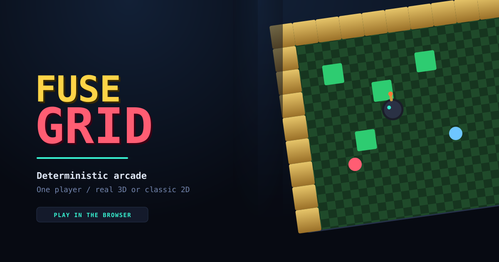

# FUSEGRID

[](https://hmarzban.github.io/fusegrid/)

Deterministic single-player bomb-grid arcade. ES modules, no bundler, no npm runtime deps.

**Play:** [hmarzban.github.io/fusegrid](https://hmarzban.github.io/fusegrid/)

## Play locally

```bash
npm start          # http://127.0.0.1:8080/index.html  (loopback only)
npm test           # node --test
```

`serve.js` binds **127.0.0.1** on purpose. Public play is GitHub Pages (static files), not a rebind.

## Controls

| Input | Action |
|---|---|
| WASD / arrows | Move |
| Space | Place bomb |
| Shift+Space | Throw (needs throw power-up) |
| Q | Detonate remote (needs remote power-up) |
| K + move | Kick (needs kick power-up) |
| P | Pause |
| M / Menu | Quit to menu |

Menu **RENDER** toggles REAL 3D ⇄ CLASSIC 2D. Flags: `?render=3d`, `?render=iso` (legacy dimetric), `?play=1`, `?orbit=1`, `?net=local` (1P lockstep harness), `?debug=1`.

Internet multiplayer is not shipped — the sim is one player.

## Levels

Five biomes, selectable 1–5 (no wrap):

| Lv | Look |
|---|---|
| 1 | JUNGLE — bright grass, gold stumps |
| 2 | ICE — white cubes, navy cliffs |
| 3 | FACTORY — amber crates, steel |
| 4 | WATER — teal sewer / ruins |
| 5 | ARENA — night court, rose bricks |

Clear every enemy to advance. Collect bombs, flame, kick, throw, remote, and shield.

## License

MIT. Three.js r160 is vendored under MIT (`vendor/three.module.js`).
