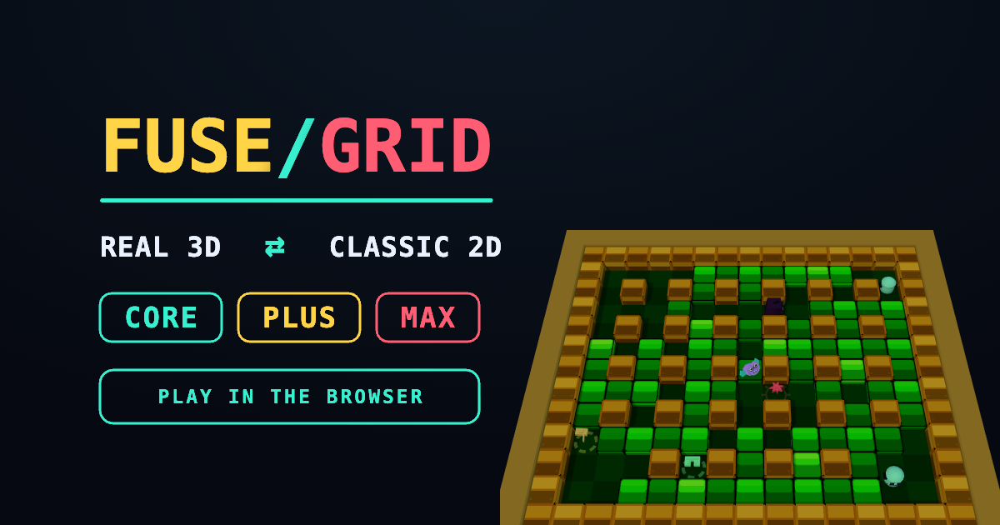

# Fusegrid

**FUSE/GRID** is a single-player, deterministic bomb-grid arcade you play in the browser. Flip **REAL 3D ⇄ CLASSIC 2D** from the cabinet menu, pick your Heat on LEVEL SELECT, and clear every enemy to advance.

[](https://hmarzban.github.io/fusegrid/)

**Play now:** [https://hmarzban.github.io/fusegrid/](https://hmarzban.github.io/fusegrid/)

Share that URL **with the trailing slash** so chat apps load the preview card (`og.png`, 1200×630). The no-slash redirect drops Open Graph tags.

## Features

- **Opening** — a FUSE/GRID title waits for any key or tap, which starts the music and a ~4 s show that blasts open the menu. Any key skips the show.
- **REAL 3D ⇄ CLASSIC 2D** — **OPTIONS → RENDER** toggles WebGL and classic Canvas; no reload. REAL 3D frames the whole board from one 3/4 camera; wheel or pinch zooms, and zoom resets to your CAMERA preset every room. OPTIONS also holds music and SFX volume, the 3D camera preset, brightness, screen shake, and reduce-flash.
- **Heat** — CORE / PLUS / MAX on LEVEL SELECT (`↑/↓`). CORE is the baseline run; PLUS and MAX tighten fuse, spawns, and pressure.
- **Eight rooms** — five biomes on a fresh install (JUNGLE → ARENA), then SAND, VOID, and CROWN after your first clear.
- **Pact afterburner** — optional LAST / BARE / THIN / SHRINK toggles (`1`–`4`) unlock with rooms 6–8; CORE with every toggle off matches baseline v6. `5` adds TIME ATTACK: a play-only stopwatch with a per-room best.
- **Run summary** — GAME OVER and the finale show your tally and a delta against your saved best for that heat: NEW BEST, FURTHEST ROOM YET, MATCHED, or how far short you fell. Combo callouts and a close-call flash fire during play (both respect reduce-flash).
- **DAILY** — one board a day, seeded from the date. Your tries and best for the day are kept on this device only; nobody is ranked.
- **Challenge code** — on the end screen, `B` copies a twelve-character board code (seed, heat, pact, pace — never a score). Open `…/fusegrid/?code=XXXXXXXXXXXX` to play the same board.
- **STATS** — a cabinet page with lifetime runs, rooms, deaths, kills, pickups, play time, and your CORE / PLUS / MAX bests; `C` copies it as text. Four local plaques on HIGH SCORES. STATS also counts lifetime **DAYS PLAYED**.
- **Medals** — eight medals for finale clears; `T` (or a tap on `T MEDALS`) on STATS opens the MEDALS page.
- **Ghost** — after your fastest clear of a room, replaying that exact board (same seed, room, heat, pact, pace) races a translucent copy of your best route, in 2D and 3D.
- **Reset my cabinet** — on STATS, press `R` twice (or tap `R RESET`, then `R AGAIN`) to wipe progress and reload; settings and pace are kept, anything else cancels.
- **Coach** — a ghost shows the first bomb on a fresh install, then one short tip the first time you pick up KICK, THROW, or REMOTE.
- **Cabinet help** — **GUIDE** (HOW TO, ITEMS, ENEMIES), HIGH SCORES, STATS, and **SOURCE** (opens [github.com/HMarzban/fusegrid](https://github.com/HMarzban/fusegrid)).
- **Chiptune + boom** — each room has its own theme and blast tint.
- **PWA** — install from the browser; offline play after the first visit (first load still needs network).
- **Pure ES modules** — no bundler, no npm runtime dependencies. Three.js r160 is vendored for 3D only.

This is **single-player** arcade play. Internet multiplayer is not shipped. The sim is deterministic: same inputs, same outcome.

## How to play

Clear every enemy in the room to advance. Gold **WALL** never breaks; green **BRICK** breaks and stops a normal blast. Collect floor cubes for bombs, flame range, kick, throw, remote, and shield. Surviving a hit leaves live bombs and blades in the world.

| Input | Action |
|---|---|
| WASD / arrows | Move |
| Space (or J / X) | Place bomb |
| Shift + Space | Throw *(needs throw power-up)* |
| Q | Detonate remote *(needs remote power-up)* |
| K + move | Kick *(needs kick power-up)* |
| R *(in a run)* | Reset the camera and zoom |
| P / Esc | Pause (RESUME / RESTART / OPTIONS / QUIT TO MENU); ↑↓ + Enter pick a row |
| M *(paused)* | Quit to menu |
| Space / Enter *(end screen)* | Next room, back to the menu after the finale, or a new run after GAME OVER |
| C *(end screen or STATS)* | Copy your result or your stats as text (both say COPIED, or COPY FAILED) |
| B *(end screen)* | Copy the board's challenge link (the end screen says BOARD LINK COPIED) |
| T *(STATS)* | Open the MEDALS page |
| R, R *(STATS)* | Reset my cabinet (two presses; any other key cancels) |

On touch devices during a run, a virtual D-pad and bomb button sit off the board: docked low in the thumb zone in portrait (the board sits mid-screen), in the side gutters in landscape, with pause above. STATS's MEDALS, Copy and Reset labels are tappable. Power-ups marked with `*` in the in-game HOW TO need their pickup first. Everything the game remembers lives in your browser's local storage; there is no account, server, or leaderboard. See [CHANGELOG.md](CHANGELOG.md) for what changed in each release.

## Progression

### Rooms

| Room | Look | Notes |
|---|---|---|
| 1 | JUNGLE | Bright grass, gold stumps |
| 2 | ICE | White cubes, navy cliffs |
| 3 | FACTORY | Amber crates, steel |
| 4 | WATER | Teal sewer / ruins |
| 5 | ARENA | Night court, rose bricks — **finale on first run** |
| 6 | SAND | Ochre dunes *(unlocks after first CLEAR)* |
| 7 | VOID | Violet dark, tall cliffs *(unlocks after first CLEAR)* |
| 8 | CROWN | Gold court — **finale after unlock** *(unlocks after first CLEAR)* |

On LEVEL SELECT, `←/→` picks the room, `↑/↓` picks Heat and `[`/`]` picks pace (EASY / NORM / HARD); Enter starts, Esc backs out. Menus use the arrows, Enter and Esc throughout. The title waits for any key or tap, which starts the music and a short opening show; any key skips the show.

### Heat

| Grade | Effect |
|---|---|
| **CORE** | Baseline v6 — replay reference |
| **PLUS** | Harder spawns and tighter fuse |
| **MAX** | Highest pressure |

Attract mode always runs CORE with Pact off, regardless of your last selection.

### Unlock: rooms 6–8 and Pact

Beat room 5 (FUSE/GRID CLEAR) once and LEVEL SELECT unlocks rooms 6–8 plus four optional **Pact** toggles. Fresh installs show rooms 1–5 only — that is intentional gating, not a bug.

| Key | Pact | Rule |
|---|---|---|
| `1` | LAST | Start with one life |
| `2` | BARE | No walkable floor cubes |
| `3` | THIN | One fewer buried cube under breakables |
| `4` | SHRINK | Arena walls close inward over time |

Toggle with `1`–`4` on LEVEL SELECT. A CORE run with all Pact toggles off stays bit-identical to baseline v6.

### Scoring

The live HUD shows raw points during play. **HIGH SCORES** stores Heat-scaled totals only: CORE ×1, PLUS ×2, MAX ×3.

## Play online and install

- **Browser:** [https://hmarzban.github.io/fusegrid/](https://hmarzban.github.io/fusegrid/)
- **Install (PWA):** use Add to Home Screen / Install app in a supporting browser. The app shell precaches on first visit; later sessions work offline. The first visit still needs network.

## Development

The public game is **Fusegrid**; this repository folder is **`rollblock`**. Clone, serve locally, and run tests — no build step.

**Requirements:** Node.js v26 ( `"type": "module"` ).

```bash
git clone https://github.com/HMarzban/fusegrid.git rollblock
cd rollblock
npm start          # http://127.0.0.1:8080/index.html  (loopback only)
npm test           # node --test
```

`serve.js` binds **127.0.0.1** on purpose. Public play is GitHub Pages (static files), not a rebind of the local server.

**URL flags** (append to `index.html`):

| Flag | Purpose |
|---|---|
| `?render=3d` | Start in REAL 3D |
| `?render=iso` | Legacy dimetric renderer |
| `?play=1` | Skip intro |
| `?orbit=1` | Orbit camera (3D) |
| `?net=local` | Local lockstep harness (1P proof, not multiplayer) |
| `?debug=1` | Debug overlay |

**Test Pact locally without clearing room 5:** in devtools console, `localStorage.setItem('nb.pact.v1','1')` then reload LEVEL SELECT.

Read the [architecture and tradeoffs](docs/architecture.md) for the simulation/rendering boundary, replay checks, and multiplayer limits. Contributor conventions and agent notes remain in [`AGENTS.md`](AGENTS.md).

Pull requests run the Node test suite. Pages deployment runs only after those tests pass on the commit being deployed.

### Listing art

Store/listing art (itch.io cover, room stills, and a short gameplay GIF) lives
in [`media/`](media/), captured from the live game — see
[`media/README.md`](media/README.md) for what each asset is and the zip
recipe for an itch/Newgrounds/Game Jolt HTML5 upload.

## License

MIT — see [`LICENSE`](LICENSE). Three.js r160 is vendored under MIT in `vendor/three.module.js`.

## Repository

[https://github.com/HMarzban/fusegrid](https://github.com/HMarzban/fusegrid)
